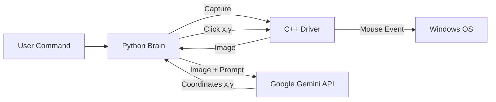

# 👻 Ghost-01: The Universal Large Action Model (LAM)

> **"Giving AI Eyes and Hands to automate the un-automatable."**

---

## 📖 Project Overview
**Ghost-01** is an "Agentic AI" that controls a computer exactly like a human does: **Visually.**

While traditional automation (like Selenium) relies on hidden code, Ghost-01 uses **Google Gemini 1.5** to see the screen pixels and a custom **C++ Driver** to physically move the mouse. This allows it to automate *any* software—legacy enterprise apps, games, and desktop tools—without needing an API.

---

## 🏗️ How It Works
The system follows a "See-Think-Act" loop:

1.  **See:** The **C++ Driver** captures the screen in real-time.
2.  **Think:** The **Python Brain** sends the image to **Gemini 1.5 Flash**, which analyzes the UI to find the coordinates of buttons (e.g., "The Recycle Bin").
3.  **Act:** The **C++ Driver** receives the coordinates and performs a hardware-level mouse click.

##🛠️ Tech Stack
Artificial Intelligence: Google Gemini 1.5 Flash (Vision & Spatial Reasoning)

Core Driver: C++ (WinAPI, GDI+, Windows Sockets)

Orchestration: Python 3.10+

Communication: Local TCP Socket Bridge (Port 8080)

##🚀 Installation & Setup
Prerequisites

1.    Windows 10 or 11

2.    G++ Compiler (MinGW)

3.    Python 3.8 or higher

4.    Google Gemini API Key

1. Compile the Driver (The Hands)
Open your terminal in the project folder and run:

g++ ghost_driver.cpp -o ghost_driver.exe -lgdi32 -lws2_32 -lgdiplus

2. Install Python Dependencies (The Brain)

pip install google-generativeai pillow

3. Configure API Key
Open ghost_brain.py in a text editor and paste your Google API Key:

GOOGLE_API_KEY = "YOUR_ACTUAL_API_KEY_HERE"

##🎮 How to Run
Step 1: Start the Driver
⚠️ Important: You must run the driver as Administrator so it can control the mouse over system apps.

1.Right-click ghost_driver.exe.

2.Select "Run as Administrator".

You should see: Ghost-01 Listening on Port 8080...

Step 2: Start the Brain
Open a new terminal window and run:

python ghost_brain.py

Step 3: Command It
Type natural language commands in the Python window:

1."Open Recycle Bin"

2."Click the Start Button"

3."Click the Chrome icon"

## TEAM codecrew
